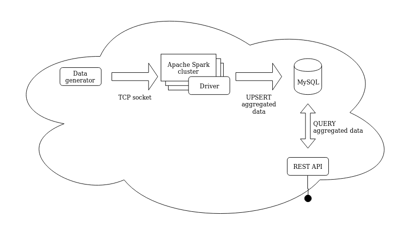

# Celtra Analytics Engineer Challenge
Challenge description is located [here](https://gist.github.com/anzebrvar/6b137727997c1e20bcd67c92666cbafd).

# Requirements
- docker (tested on v19.03.3)
- docker-compose (tested on v1.24.1)
- make (tested on GNU Make v4.2.1)

# Commands
- `$ make up`             - Start Spark cluster, MySQL db (with fake data), Dummy data generator (over TCP socket), Spark driver program & REST API
- `$ make scale n=3`      - Scale Spark worker nodes
- `$ make down`           - Stop all dependencies 

# Solution overview


# Demo APIs

**Question 1: How many impressions were trafficked each day for each campaign?**
```bash
curl http://localhost:8080/api/campaigns/timeseries
```

**Question 2: How many impressions, interactions and swipes were trafficked for each ad in the specific campaign?**
```bash
curl http://localhost:8080/api/campaigns/1/ads
```

**Question 2: How many unique users and impressions were trafficked each day for each ad in the last 7 days?**
```bash
curl http://localhost:8080/api/campaigns/ads/lastweek
```

# TODOs
- Implement REST APIs
- Add unit tests
- Move hard coded configurations to environment variables